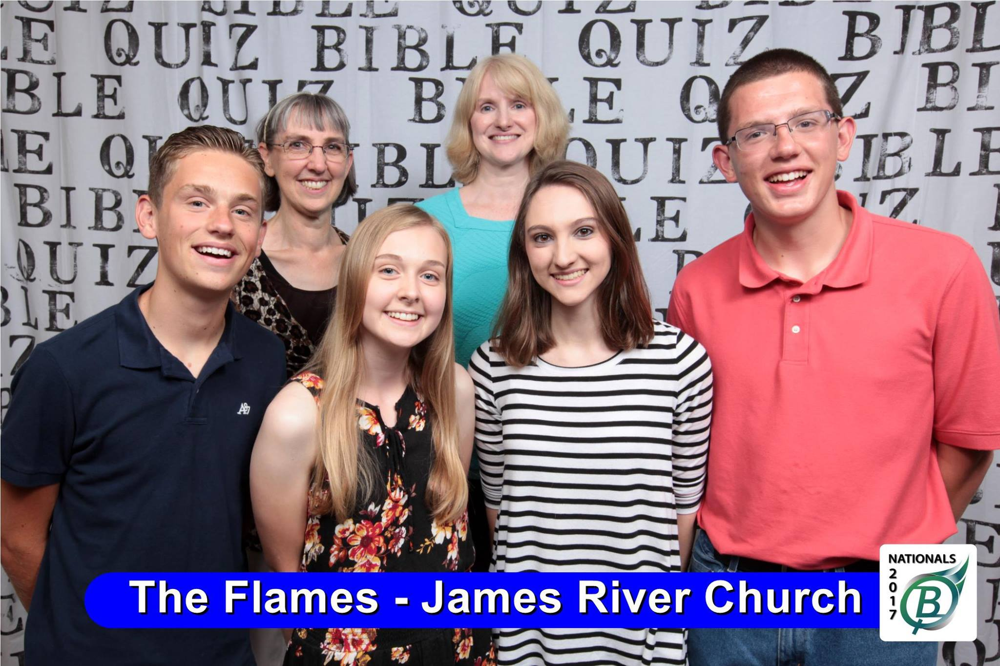

\[siteorigin\_widget class="kad\_imgmenu\_widget"\]\[/siteorigin\_widget\]

\[siteorigin\_widget class="kad\_imgmenu\_widget"\]\[/siteorigin\_widget\]

\[siteorigin\_widget class="kad\_imgmenu\_widget"\]\[/siteorigin\_widget\]

### SCHEDULE

- [Sat. June 30](#sctab8770)
- [Sun. July 1](#sctab8771)
- [Mon. July 2](#sctab8772)
- [Tue. July 3](#sctab8773)
- [Wed. July 4](#sctab8774)
- [Thu. July 5](#sctab8775)
- [Fri. July 6](#sctab8776)

<table style="width:100%; " class="easy-table easy-table-default "><tbody><tr><td>12:00pm</td><td>Volleyball Tournament</td><td>Calvary Church</td></tr><tr><td>6:00pm-8:00pm</td><td>Team Registration</td><td>Hotel meeting rooms</td></tr><tr><td>8:15pm</td><td>Ice Cream Fellowship</td><td>Hotel meeting rooms</td></tr></tbody></table>

<table style="width:100%; " class="easy-table easy-table-default "><tbody><tr><td>11:00am</td><td>Celebration Service</td><td>Calvary Church (Sanctuary Sec 201 &amp; 202)</td></tr><tr><td>3:30pm</td><td>Quoting Bee</td><td>Quiz Rooms &amp; Fellowship Hall</td></tr><tr><td>4:30pm</td><td>Officials Assignment</td><td>Ministry Training Center</td></tr><tr><td>4:45pm</td><td>Senior Shootout</td><td>Fellowship Hall</td></tr><tr><td>5:30pm</td><td>Festival</td><td>Calvary Church Grounds</td></tr></tbody></table>

<table style="width:100%; " class="easy-table easy-table-default "><tbody><tr><td>9:30am</td><td>Worship</td><td>Calvary Church Seminar Room</td></tr><tr><td>10:15am</td><td>Preliminary Round 1/One-on-One</td><td>Classrooms</td></tr><tr><td>11:00am</td><td>Preliminary Round 2</td><td>Classrooms</td></tr><tr><td>11:45am</td><td>Preliminary Round 3</td><td>Classrooms</td></tr><tr><td>12:30pm</td><td>Preliminary Round 4</td><td>Classrooms</td></tr><tr><td>1:15pm</td><td>Lunch</td><td>Fellowship Hall</td></tr><tr><td>2:00pm</td><td>Preliminary Round 5/One-on-One</td><td>Classrooms</td></tr><tr><td>2:45pm</td><td>Preliminary Round 6</td><td>Classrooms</td></tr><tr><td>3:30pm</td><td>Preliminary Round 7</td><td>Classrooms</td></tr><tr><td>4:15pm</td><td><a href="https://youtu.be/s2R2sH2ScBM?t=2s" target="_blank" rel="noopener noreferrer">Playoff (if necessary)</a></td><td>Classrooms</td></tr><tr><td>5:00pm</td><td><a href="https://youtu.be/s2R2sH2ScBM?t=2s" target="_blank" rel="noopener noreferrer">Playoff (if necessary)</a></td><td>Classrooms</td></tr></tbody></table>

<table style="width:100%; " class="easy-table easy-table-default "><tbody><tr><td>9:00am</td><td>Worship</td><td>Seminar Room</td></tr><tr><td>9:45am</td><td>Round 1/One-on-One</td><td>Classrooms</td></tr><tr><td>10:30am</td><td>Round 2</td><td>Classrooms</td></tr><tr><td>11:15am</td><td>Round 3</td><td>Classrooms</td></tr><tr><td>12:00pm</td><td>Round 4</td><td>Classrooms</td></tr><tr><td>12:45pm</td><td>Round 5</td><td>Classrooms</td></tr><tr><td>1:30pm</td><td>Lunch</td><td>Fellowship Hall</td></tr><tr><td>2:15pm</td><td>Round 6/One-on-One</td><td>Classrooms</td></tr><tr><td>3:00pm</td><td>Round 7</td><td>Classrooms</td></tr><tr><td>3:45pm</td><td>Round 8</td><td>Classrooms</td></tr><tr><td>4:30pm</td><td>Round 9</td><td>Classrooms</td></tr><tr><td>7:00pm</td><td>Group Activity</td><td>Hotel Meeting Rooms</td></tr><tr><td>7:00pm-9:00pm</td><td>Alumni Fellowship</td><td>Calvary Church</td></tr></tbody></table>

<table style="width:100%; " class="easy-table easy-table-default "><tbody><tr><td>9:00am</td><td>Worship</td><td>Seminar Room</td></tr><tr><td>9:45am</td><td>Round 10/One-on-One</td><td>Classrooms</td></tr><tr><td>10:30am</td><td>Round 11</td><td>Classrooms</td></tr><tr><td>11:15am</td><td>Round 12</td><td>Classrooms</td></tr><tr><td>12:00pm</td><td>Round 13</td><td>Classrooms</td></tr><tr><td>12:45pm</td><td>Round 14</td><td>Classrooms</td></tr><tr><td>1:30pm</td><td>Lunch</td><td>Fellowship Hall</td></tr><tr><td>2:15pm</td><td>Round 15/One-on-One</td><td>Classrooms</td></tr><tr><td>3:00pm</td><td>Round 16</td><td>Classrooms</td></tr><tr><td>3:45pm</td><td>Round 17</td><td>Classrooms</td></tr></tbody></table>

<table style="width:100%; " class="easy-table easy-table-default "><tbody><tr><td>9:00am</td><td>Worship</td><td>Seminar Room</td></tr><tr><td>9:45am</td><td>Round 18</td><td>Classrooms</td></tr><tr><td>10:30am</td><td>Round 19</td><td>Classrooms</td></tr><tr><td>11:15am</td><td>1 vs 4; 2 vs 3 (Championship)</td><td>Classrooms</td></tr><tr><td>11:15am</td><td>Challenger Division Championship Match</td><td>Classrooms</td></tr><tr><td>12:00pm</td><td>3rd Place Match</td><td>Classrooms</td></tr><tr><td>12:45pm</td><td>Championship Match</td><td>Seminar Room (tentative)</td></tr><tr><td>1:30pm</td><td>Lunch</td><td>Fellowship Hall</td></tr><tr><td>2:30pm</td><td>Individual Tournament</td><td>Classrooms</td></tr><tr><td>6:30 p.m.</td><td>Glorious Extravaganza Team Fellowship</td><td>Calvary Church</td></tr></tbody></table>

<table style="width:100%; " class="easy-table easy-table-default "><tbody><tr><td>9:45am</td><td>Adult Quizzing</td><td>Calvary Church</td></tr><tr><td>6:45pm</td><td>Awards Banquet</td><td>Calvary Church</td></tr></tbody></table>

### HELPFUL LINKS

[Nationals Registration & Information](https://youth.ag.org/Participate/Bible-Quiz/Nationals)

[Order National-level Practice Questions from Former Quizzers](https://www.biblequiz.com/questions/)

[\[VIDEOS\] Training for Scorekeepers](https://www.youtube.com/watch?v=u1jXAshiqwA&list=PLKq6sDn4qSnqA1mzlYV8Ny1xj0sxfDsdI)

### 2017 NATIONAL CHAMPIONS

### Participants

### Northwest

Cedar Park AG, Bothell, WA  
Kuna Life Center, Kuna, ID  
Cedar Park AG, Bothell, WA (Team 2)  
Bellevue Neighborhood Church, WA  
Tacoma Life Center, Tacoma, WA

### North Central

Bethel A/G, Rapid City, SD  
Sioux Falls First, Sioux Falls, SD  
Taylor A/G, Taylor, NE

### Great Lakes

Calvary Church, Naperville, IL  
First A/G, Lexington, KY  
Greater Lansing, MI  
Grant A/G, Grant, MI  
Trinity A/G, Georgetown, KY  
Dayspring A/G, Bowling Green, OH

### Northeast

Maple Lane A/G, Deposit, NY  
Newport AG, Newport, PA  
Mechanicsville CC, Mechanicsville, VA  
Evangel Heights, Sarver, PA  
Word of Life, Springfield, VA  
LHWC, Swedesboro, NJ  
Central A/G, Houston, PA  
Allison Park Church, Allison Park, PA  
Kennebec Valley A/G, Chelsea, ME  
Maple Lane A/G, Deposit, NY (Team 2)  
Bethany Church, Wyckoff, NJ

### Southwest

Dream City Church, Scottsdale, AZ  
Orange Hills, Orange, CA

### South Central

The Oaks Fellowship, Red Oak, TX  
Trinity Church, Cedar Hill, TX  
Muskogee First Assembly, OK  
Christian Temple, Houston, TX

### Gulf

James River Church, Ozark, MO  
Evangel Temple, Springfield, MO  
James River Church, Ozark, MO (Team 2)  
Crown Pointe, Lee Summit, MO  
Life 360, Springfield, MO

### Southeast

Calvary A/G, Greensboro, NC (2 teams)  
Life Church, Wesley Chapel, FL  
Atlanta Tamil Church, Norcross, GA
