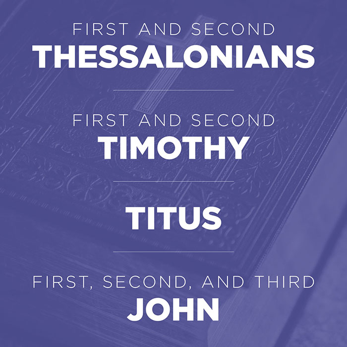
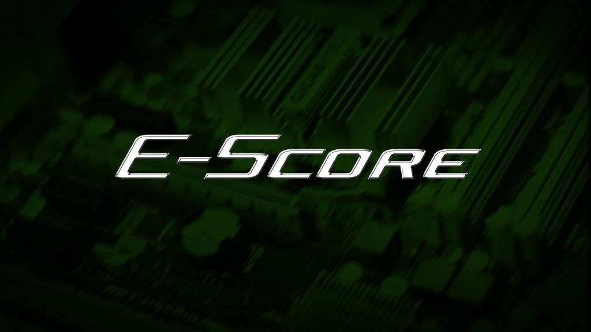
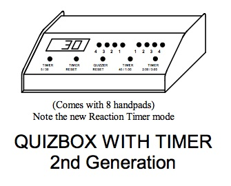
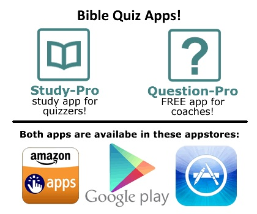

## Question-Pro/Writer

This amazing program allows coaches to create custom sets for both practice and individual study. Choose only 10-pointers for beginning quizzers, or quotation questions for veterans. Select by point value, question type, and chapter range. _Question-Pro_ monitors questions already used and includes printing capabilities. It also comes with two databases of practice questions containing over 2,000 questions! Includes _Question-Writer_, which allows coaches to create and modify their own question databases, which can then be loaded into _Question-Pro_. Unique words and misspelled words are automatically highlighted as you type.

- One-time purchase for PC
- Requires Windows 10/8/7
- Licensed for team use

[Go now](https://myhealthychurch.com/store/startitem.cfm?item=351769&cat=YMBIBQUIZ&mastercat=&path=YMBIBQUIZ)

## My Healthy Church

Get starter bundles, scripture portions, questions, and valuable study resources from My Healthy Church, the official product store from the Assemblies of God.

[Go now](https://myhealthychurch.com/store/startcat.cfm?cat=YMBIBQUIZ&mastercat=&path=YMBIBQUIZ)

* * *

## E-Score

The powerful, easy to use Bible Quiz scoresheet for Microsoft Excel. One license covers an entire church forever! Available for digital download.

[Buy now](https://escore.jameslex.com/)

* * *

## QuizEquipment.com

Steve Kirkman's buzzer set is the most popular set used in AG quizzing.

[Browse catalog](http://www.quizequipment.com/quizbox_pdf/ag_info.pdf)

* * *

## BibleQuizShop.com

A myriad of helpful products for AG Bible Quiz! Recently popular for selling paper quote cards, BibleQuizShop.com is famous for apps to write questions, generate sets, study with electronic quote cards, and even quiz with online buzzers! Available for Windows, iOS, Android, and Amazon.

[Browse catalog](https://ag.biblequizshop.com/)
