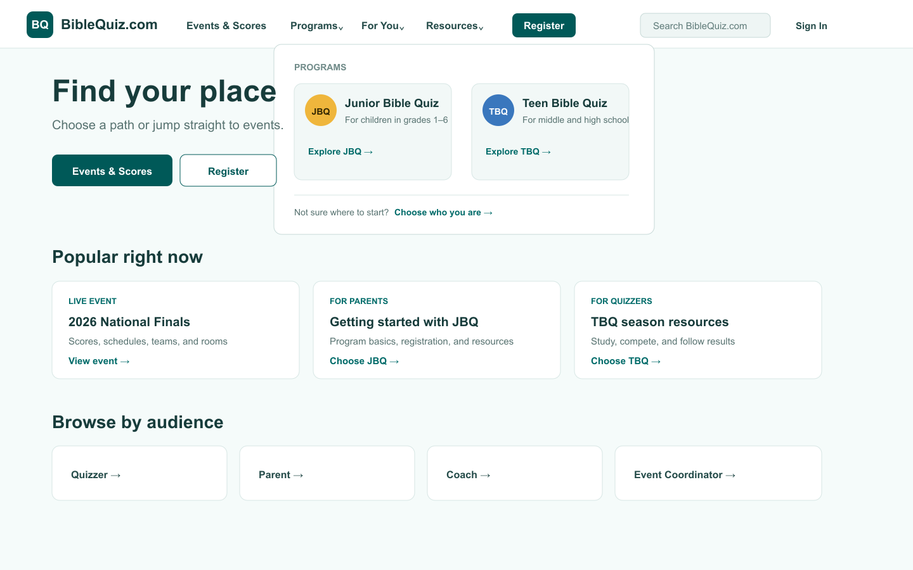
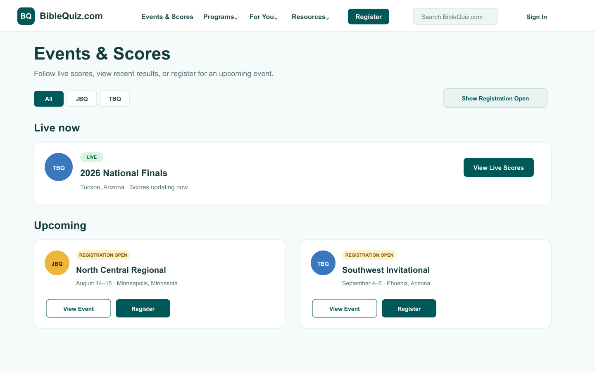
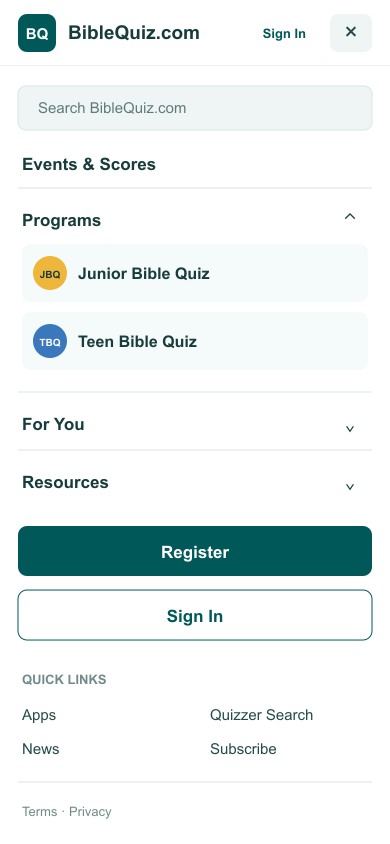
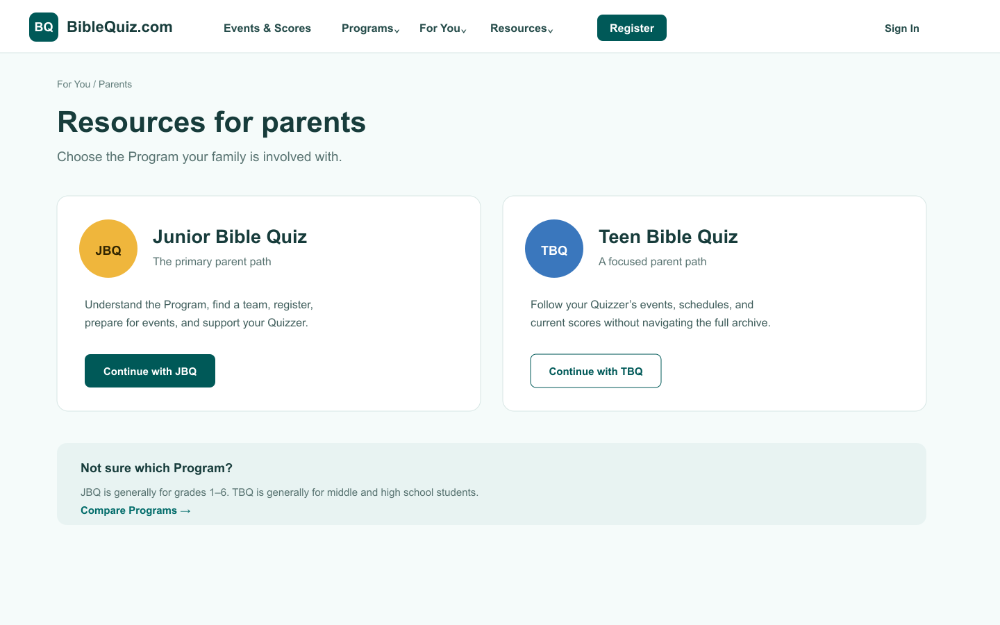
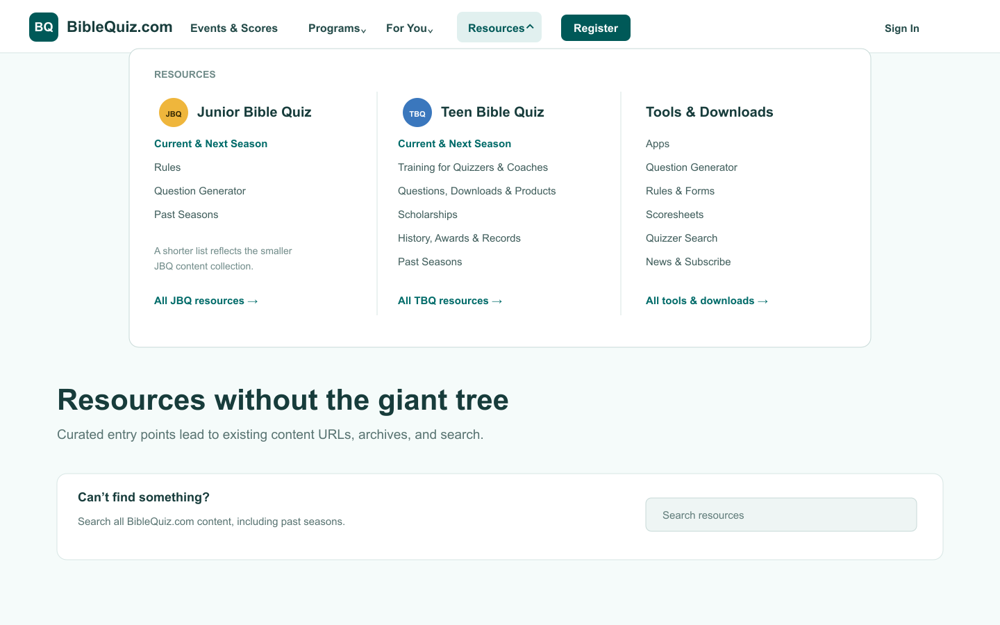
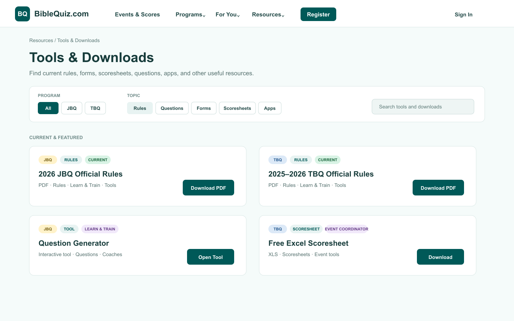
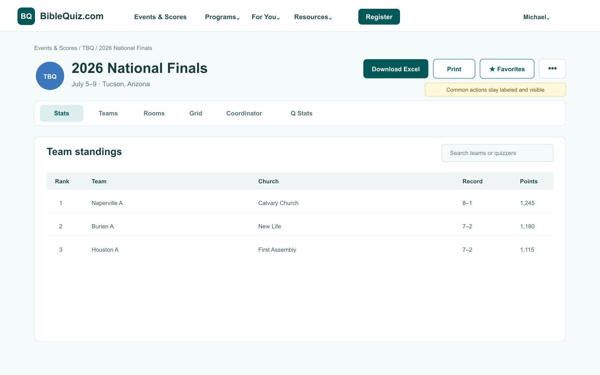
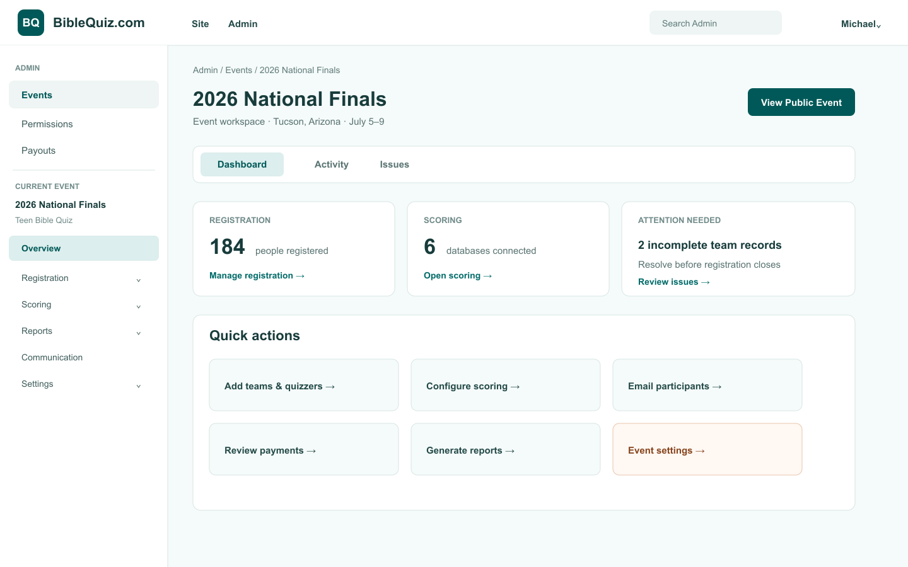

# BibleQuiz.com Navigation Migration Plan

**Status:** Implemented on `users/michsco/nav`; ready for preview feedback
**Scope:** Public navigation, content discovery, page actions, authenticated Admin navigation, and migration/cutover  
**Constraints:** Existing public URLs remain stable. Implementation occurs on a feature branch deployed to a dedicated review domain; merging to `main` is the production cutover.

## Implementation handoff

The feature branch contains the new public shell, frontmatter-driven Resource model, Program and audience hubs, combined event/registration actions, capability-based Admin entry points, workspace sidebar, content-authoring documentation, and restored discovery for existing TBQ Training and History content. Wiki is intentionally excluded.

Routine validation passes with `npm run check`. The remaining migration work is the preview-domain feedback cycle, comprehensive manual viewport/accessibility/authorization checks, any refinements found during feedback, and the merge-to-`main` cutover described in Phases 5 and 6.

## Outcome

Replace the site-wide content sidebar with a task-oriented global navigation that makes Program, audience, live-event, registration, and resource paths obvious. Retain a contextual sidebar only where it is the established pattern for a dense Admin workspace. Make common page actions visible as labeled controls rather than icon-only commands.

This is an information-architecture and application-shell migration. The visual design may change substantially as long as all relevant content and operations remain accessible.

## Agreed design principles

1. **Program and audience are separate dimensions.** Programs are JBQ and TBQ. Audiences are Quizzers, Parents, Coaches, and Event Coordinators.
2. **The Event List remains Home.** `/` stays the canonical combined list for live/upcoming events, scores, and registration. Existing `?type=jbq|tbq` links and redirects remain valid.
3. **Events and authentication are always available.** Events & Scores, Register, and Sign In/Profile remain visible in the global shell on desktop and mobile.
4. **No mandatory gateway.** Visitors can go directly to the Event List, Programs, or registration without first identifying their audience or Program.
5. **Guided paths remain available.** A visible For You menu guides each audience to a Program choice, then to a dedicated audience-within-Program guide where that combination is meaningful.
6. **Do not force symmetry.** TBQ and JBQ may use different resource taxonomies because TBQ has significantly more content.
7. **Multiple discovery paths, one canonical Resource.** A Resource may appear under Learn & Train, Tools, Downloads, a Program, and an audience guide without duplicating its content or metadata.
8. **Stable URLs, not dual behavior.** Navigation changes do not move existing public URLs, but the feature branch does not need to preserve the old sidebar or run both shells in parallel.
9. **Public and Admin navigation solve different problems.** Public pages use global top navigation. The dense Admin workspace uses contextual side navigation and in-section tabs.
10. **Actions are not navigation.** Common commands such as Register, Download Excel, and Print appear as labeled controls. Rare commands move to More.
11. **Maintainability is a deliverable.** Shared behavior uses explicit typed models and reusable components. The design must remain understandable and safely editable by a developer without relying on an AI agent.
12. **Frontmatter remains the content-authoring interface.** Contributors classify and promote content by editing the page frontmatter they already use. Routine content changes do not require editing TypeScript or understanding component internals.
13. **Preview before cutover.** Deploy the feature branch to a dedicated domain, gather informal feedback, address findings, then merge to `main` to switch production.

## Proposed information architecture

### Global header

| Item | Behavior |
| --- | --- |
| BibleQuiz.com logo | `/`, the combined Event List |
| Events & Scores | `/`, preserving optional `?type=jbq|tbq`; always visible |
| Programs | Mega menu and landing page for JBQ and TBQ |
| For You | Mega menu and landing page for Quizzer, Parent, Coach, and Event Coordinator paths |
| Resources | Mega menu and landing page, organized by Program and topic |
| Register | Persistent primary call to action that opens `/` with registration-open events emphasized; selecting Register on an event continues to `/register/#/{eventId}` |
| Search | Existing Pagefind-powered site search |
| Admin | Signed-in, capability-based work area; hidden when no Admin tools are available |
| Sign In/Profile | Persistent account control; remains separate from Admin and visible at every viewport |

Desktop uses mega menus for Programs, For You, and Resources. Use a navigable label plus a separate disclosure control so keyboard and touch behavior is unambiguous. Mobile renders the same hierarchy as an accordion drawer while keeping Events & Scores, Register, and Sign In/Profile directly reachable.

### Home and Event List

`/` remains the existing Event List rather than becoming a marketing-only landing page. The list should make its two purposes explicit:

- **Scores:** live, recent, and published event pages
- **Registration:** upcoming events whose registration window is open

Replace the current single card destination—which changes between scores and registration based on event state—with explicit actions:

- View Event or View Scores when a public event/results page exists
- Register when registration is open
- A clear status label such as Live, Registration Open, Upcoming, or Results Available

The global Register action should focus or filter the same list to registration-open events; it should not create a competing registration directory.

### Footer

- Terms and Privacy
- Social links and contact
- Optional repeated links to News and Subscribe

News, Subscribe, Apps, and Quizzer Search live under Resources. Apps and Quizzer Search also appear as shortcuts on relevant Program and audience guides. The unused Wiki is excluded from the replacement navigation.

### Program landing pages

Keep `/jbq/` and `/tbq/` as the canonical Program pages.

Each page should provide:

- Program overview and current-season focus
- Live/upcoming and recent results
- Direct links back to the Event List for scores and registration
- Audience shortcuts that are meaningful for that Program
- Program-specific resource categories
- Past seasons/history without placing every season in global navigation

JBQ and TBQ share visual patterns but not a forced category list.

### Audience paths

Add landing pages under a stable For You namespace, such as:

- `/for-you/quizzers/`
- `/for-you/parents/`
- `/for-you/coaches/`
- `/for-you/event-coordinators/`

Each page first asks the visitor to choose JBQ or TBQ. Only meaningful combinations receive dedicated guides, for example `/jbq/parents/` or `/tbq/quizzers/`. Unavailable combinations explain the mismatch and direct the visitor to the Program home or the most relevant task instead of creating empty pages.

The exact audience/Program matrix is finalized during the content audit.

### Resources

Resources is a curated discovery layer over existing URLs, not a URL migration.

Resource organization is faceted rather than a single exclusive tree. For example:

- Question Generator appears under Learn & Train and Tools.
- Current JBQ and TBQ rules appear under current-season guidance, Learn & Train, and Tools & Downloads.
- Scoresheets may appear under Tools & Downloads and Event Coordinator guides.

Each placement points to the same canonical Resource definition and destination.

The canonical definition lives with the content in MDX frontmatter. It is not copied into a central TypeScript list.

Candidate groupings:

| Shared grouping | JBQ examples | TBQ examples |
| --- | --- | --- |
| Current season | Current/next season, rules | Current/next season, events, results, updates |
| Learn and train | Question Generator, rules | Quizzer, coach, and official training; questions; writers’ tips |
| Tools & Downloads | Apps, Question Generator, rules | Apps, Quizzer Search, rules, forms, scoresheets, downloads |
| History and archive | Past seasons | Past seasons, Nationals history, awards, records |
| Community | News, Subscribe | News, Subscribe, scholarships, products, links |

These are starting labels, not a requirement to create empty JBQ categories.

### Downloadable Resources

Replace the TBQ-only catch-all downloads page and scattered direct-download discovery with a shared, filterable catalog. Keep existing asset URLs and context-specific links, but give current high-value files a consistent discovery surface.

The catalog should support:

- Program: JBQ, TBQ, or shared
- Topic: rules, questions, forms, scoresheets, graphics, video, awards, event materials
- Audience: Quizzer, Parent, Coach, Event Coordinator
- Season or year, including a clear Current designation
- File type and external-download status
- Short description and canonical destination
- Multiple topic/audience placements from one definition

Current season pages may still explain a file in context. They should render or reference the same Resource definition rather than repeat URLs, titles, and metadata manually.

Not every file under `public/assets` belongs in the primary catalog. Historical event artifacts and newsletter PDFs remain discoverable in their archive context unless explicitly promoted.

### Content authoring model

Extend the existing Starlight docs frontmatter schema with one optional `resource` object. A normal page remains a Resource by linking to itself; a metadata page may point directly to a file or external URL.

```yaml
---
title: "2026 JBQ Official Rules"
description: "The current official Junior Bible Quiz rules."
resource:
  programs: [jbq]
  audiences: [parent, coach, event-coordinator]
  topics: [rules, learn, tools]
  format: pdf
  href: /assets/2026/2026-jbq-rules.pdf
  season: 2026
  current: true
  featured: true
  actionLabel: Download PDF
---
```

Rules:

- `title` and `description` continue to use standard page frontmatter.
- `resource` is optional; pages without it behave as they do today.
- `href` is optional and defaults to the page URL.
- `resource.label` and `resource.order` are optional. Existing `sidebar.label` and `sidebar.order` remain the fallback so intentional names and ordering survive the migration.
- Programs, audiences, and topics are arrays because a Resource may appear in multiple places.
- Enumerated values are documented and validated by the content schema.
- Current/featured flags affect discovery, not the canonical URL.
- Content contributors never edit navigation components to add a Resource.

For a page that explains several related files, such as the TBQ rules page, the catalog links to the explanatory page. Use separate lightweight MDX metadata entries only when individual files need independent titles, filters, or promotion.

See [Content and Resource Authoring](./navigation-content-authoring.md) for the contributor workflow and examples.

## Visual proposal

The screenshots are conceptual and validate hierarchy, placement, and discoverability. They are not pixel-perfect implementation specifications.

### Public desktop with Programs mega menu



### Combined Event List for scores and registration



### Public mobile accordion navigation



### Audience chooses a Program



### Resources mega menu with asymmetric Program content



### Shared downloads and tools catalog



### Event page with visible actions



### Admin workspace



## Page action standard

Introduce a consistent page-header action area:

- Use a text label with an icon for common actions.
- Place the highest-value action first.
- Keep destructive, uncommon, or advanced actions in More.
- Disable actions with an explanatory state while data loads.
- Preserve keyboard access, focus visibility, and responsive wrapping.
- On narrow screens, keep the primary action visible and collapse secondary actions into an Actions menu with text labels.

For generated event pages, replace the current icon-only controls with:

1. Download Excel
2. Print
3. Favorites
4. More, including QR code and other lower-frequency actions where appropriate

Tabs such as Stats, Teams/Quizzers, Rooms, Grid, Coordinator, and Q Stats remain content views, not actions.

## Admin model

Admin is a capability-based work area, not a role or permission level.

Because the site is statically generated, Sign In/Profile and Admin capability visibility are resolved client-side at runtime. The static header must reserve a stable account-control area so hydration does not cause a disruptive layout shift.

### Admin home

Show only authorized tools:

- Manage Events for users with event-management capability
- Permissions for users with the required administrative scope
- Payouts for payout managers

Profile remains outside Admin.

### Selected-event workspace

Follow the common sports-management/SaaS hybrid pattern:

- Persistent contextual sidebar for major modules
- Breadcrumbs and event identity in the workspace header
- Tabs only for closely related views inside a module
- Dashboard with status, issues, and frequent tasks
- Labeled page actions
- Collapsed drawer on mobile

Initial module mapping:

| Workspace module | Current navigation/content |
| --- | --- |
| Overview | Dashboard and event summary |
| Registration | General, teams/quizzers, officials/attendees, fields, forms, divisions, money, other |
| Scoring | Databases, meets, live scores, teams/quizzers, awards, questions, apps |
| Reports | Event reports, season report, report settings |
| Communication | Email |
| Settings | Permissions, clone, delete, and other event configuration |

The detailed grouping must be checked against permissions and current route behavior before implementation.

## Current-to-target migration map

| Current surface | Target |
| --- | --- |
| `/` combined live/upcoming list | Remains `/`; becomes the explicit Event List for scores and registration |
| Event cards with one state-dependent destination | Separate labeled View Event/Scores and Register actions |
| Site-wide Starlight left sidebar | Global header, mega menus, landing pages, footer |
| Autogenerated JBQ/TBQ sidebar trees | Program and Resources hubs linking to unchanged URLs |
| Hundreds of past-season entries in navigation | Archive landing/filter pages; existing season URLs remain |
| Manage Events sidebar group | Conditional Admin destination |
| React event sidebar embedded into the site sidebar | Dedicated Admin workspace sidebar |
| Profile/Permissions/Payouts account dropdown | Profile remains account-level; Permissions and Payouts move to Admin |
| `/admin/profile`, `/admin/permissions`, `/admin/payouts` | URLs remain unchanged even though navigation placement changes |
| Apps and Quizzer Search top-level links | Resources plus contextual shortcuts |
| Question Generator listed only under JBQ | One canonical Resource surfaced under JBQ Learn & Train and Tools |
| `/tbq/downloads` catch-all and JBQ direct rules link | Shared Tools & Downloads catalog with Program/topic filters; existing URLs remain valid |
| Repeated hard-coded download metadata | Typed Resource definitions rendered by shared components |
| Subscribe and News | Resources |
| Wiki | Excluded from the replacement navigation for now |
| Terms and Privacy | Footer |
| Event title icon buttons | Labeled page action bar |

## Technical approach

### 1. Typed navigation model

Use two kinds of maintainable source data:

- Developer-owned manifests for the small, stable application shell: public navigation labels/groups and Admin capability/workspace groups
- Contributor-owned docs frontmatter for Resources: title, destination, Programs, audiences, topics, season, format, and featured placement

Load Resource metadata through Astro’s content collection APIs and derive repeated views from it. Do not duplicate the same link metadata in mega menus, hub pages, audience guides, and download pages.

Do not reuse the current autogenerated Starlight sidebar as the global navigation source.
Do not infer important labels or categories from directory names when they can be declared explicitly.
Do not require content contributors to edit files under `src/data` or `src/components`.

Existing page-level `sidebar` frontmatter is not removed in bulk. During migration:

1. Preserve `sidebar.label` and `sidebar.order` as fallback author metadata.
2. Map intentional groups and ordering into the new hubs before retiring autogenerated sidebar trees.
3. Add `resource.label` or `resource.order` only when the new context needs to differ.
4. Remove obsolete sidebar-only icons, collapse settings, or placeholders only after their behavior has an explicit replacement.

### 2. Application shell

Refactor the Starlight component overrides:

- `Header.astro`: render the new global navigation, search, Register, Admin, and Profile controls.
- `MobileMenuToggle.astro`: control the global accordion drawer instead of the site sidebar.
- `PageFrame.astro`: remove public sidebar layout assumptions; provide an explicit Admin workspace slot/variant.
- `Sidebar.astro` and `SidebarSublist.astro`: retire from public navigation after parity is achieved; retain or replace only the Admin-specific behavior.
- Add reusable mega-menu, mobile navigation, breadcrumb, page-header, page-action, Resource card, Resource grid, and Resource filter components.

Keep the right-side table of contents where useful; it is page-local wayfinding, not global navigation.
Reuse the existing Pagefind search integration rather than creating a second search index.

Keep component contracts narrow and explicit. Avoid cross-component DOM-ID lookups, duplicated conditional logic, and hidden mutations between Astro and React. Complex business rules should have named helpers and focused tests.

Add one focused Resource query module that:

- reads `getCollection("docs")`
- selects entries with `data.resource`
- resolves a default page URL when `resource.href` is absent
- filters by Program, audience, topic, current, and featured status
- applies deterministic display ordering

Components receive already-resolved Resource view models; they do not scan content or reinterpret frontmatter independently.

### 3. Hub and guide pages

Add:

- Programs landing page
- For You landing page and four audience selectors
- Resources landing page
- Tools & Downloads catalog
- Meaningful audience-within-Program guides
- Archive discovery pages if existing season pages do not provide adequate filtering

These pages curate existing destinations rather than duplicating content.
Archive discovery must preserve the current reverse-chronological season ordering and current/next-season behavior that is presently implemented in the custom sidebar.
Program, audience, topic, and download views should reuse the same Resource data and rendering components.

### 4. Contributor documentation

Add a concise authoring guide that covers:

- updating an existing page
- marking a page as a Resource
- linking a Resource directly to a file
- assigning multiple Programs, audiences, and topics
- promoting current or featured content
- adding a lightweight metadata page for a standalone download
- running `npm run check`
- common schema errors and how to correct them

Include copyable examples near the content they describe. Keep the vocabulary lists in one documented location matching the schema enums.

### 5. Page actions

Create a reusable page-action contract and migrate the generated event page first. Remove DOM-ID coupling between `EventScoringReportLoader` and icon-only Astro buttons where practical; actions should receive explicit loading and command state.

Then inventory other hidden or icon-only actions and migrate them using the same component.

### 6. Admin navigation

Separate global Admin entry points from selected-event navigation:

- Admin home determines visible tools from the authenticated profile.
- Event and season-report routers own a workspace navigation model.
- Reuse a single Admin sidebar renderer rather than injecting React entries into the public Starlight sidebar.
- Preserve current hash routes, unsaved-change blockers, authorization checks, and browser back/forward behavior.

### 7. URL and link preservation

Before changing navigation, generate a baseline inventory of:

- Content collection URLs
- Generated event and report URLs
- Admin page routes and hash routes
- Download and external links
- Resource definitions and every place each one should be surfaced
- Existing frontmatter fields and contributor workflows that must remain simple
- Existing sidebar labels, ordering, grouping, hidden entries, and external-link overrides

After migration:

- Compare the built route set to the baseline.
- Run the existing Starlight links validator.
- Add redirects only if a new hub replaces a legacy navigation-only path; do not relocate content merely to match the new taxonomy.

## Migration phases

### Phase 0: Inventory and acceptance matrix

- Export the current route set and navigation tree.
- Inventory actions, especially icon-only and menu-hidden commands.
- Inventory current downloads, forms, rules, scoresheets, graphics, videos, and external files; identify canonical and archived items.
- Identify which existing pages become canonical Resource entries and which raw files need lightweight metadata pages.
- Export and review existing sidebar labels/order before changing or deleting sidebar configuration.
- Classify every current destination as global, Program, audience, Resource, Admin, Profile, or footer.
- Resolve the meaningful audience/Program matrix.
- Record authorization rules for every Admin destination.
- Define screenshot acceptance at desktop, tablet, and mobile widths.

**Exit:** Every current link and action has a target location or an explicit retirement decision, and every promoted Resource has an author-maintained frontmatter source.

### Phase 1: Navigation foundation

- Extend `content.config.ts` with the optional Resource frontmatter schema.
- Add the developer-owned public-navigation and Admin-navigation models.
- Add the content-collection Resource query module.
- Add shared Resource cards, grids, filters, and placement selectors.
- Add the contributor authoring guide before migrating content.
- Build Programs, For You, and Resources landing pages.
- Add mega-menu and mobile-drawer components behind the preview branch.
- Add breadcrumbs and active-state logic.
- Keep current URLs and content unchanged.
- Extract the React event workspace navigation into its Admin-specific shell before removing the public sidebar.

**Exit:** Public destinations are reachable through the new shell in the preview deployment, and a contributor can add a Resource by editing only MDX frontmatter.

### Phase 2: Public layout migration

- Remove the public left sidebar.
- Keep `/` as the Event List and add explicit View Event/Scores and Register actions to each event card.
- Add a registration-open filter/focus state used by the global Register action.
- Update Program pages and build audience guides.
- Add Resource shortcuts and archive discovery.
- Replace the TBQ-only downloads page with the shared Tools & Downloads experience and add JBQ rules/download discovery.
- Migrate existing Resources incrementally by adding frontmatter; do not copy their metadata into TypeScript.
- Preserve existing sidebar labels/order as fallback until each section’s new ordering is reviewed.
- Move Terms and Privacy to the footer.
- Confirm search remains prominent.

**Exit:** Public navigation parity is complete without relying on the old sidebar.

### Phase 3: Action discoverability

- Add the page action component.
- Migrate generated event pages to labeled Download Excel, Print, and Favorites actions.
- Move QR and uncommon commands to More where appropriate.
- Inventory and migrate other hard-to-find actions.

**Exit:** High-value actions are visible, labeled, keyboard accessible, and usable on mobile.

### Phase 4: Admin migration

- Add conditional Admin home and tool cards.
- Move Permissions, Payouts, and Manage Events entry points into Admin.
- Keep Profile separate.
- Complete the dedicated workspace sidebar migration begun before public-sidebar removal.
- Add module tabs and breadcrumbs.
- Validate every capability and impersonation state.

**Exit:** Admin tasks no longer depend on the public sidebar or account dropdown.

### Phase 5: Preview deployment and feedback

- Configure the feature branch to deploy to the dedicated review domain using the production environment shape.
- Publish the complete navigation migration there; `main` and production retain the current site until cutover.
- Provide reviewers with the old site and preview site plus a short list of representative tasks.
- Collect informal feedback, categorize findings by blocked task, unclear label, excess clicks, missing content, or visual issue.
- Fix blocking and repeated findings.

**Exit:** No known missing destination or action; feedback does not reveal a repeated navigation failure.

### Phase 6: Cutover

- Merge the reviewed feature branch to `main`; this merge is the production cutover.
- Smoke test key public, event, registration, search, Profile, and Admin journeys.
- Keep the previous production deployment available for immediate rollback.

## Validation

### Automated

- `npm run check` for routine implementation validation
- Existing Starlight link validation
- Route-set comparison against the pre-migration baseline
- Component tests for navigation state and capability visibility where existing test infrastructure supports them
- Tests for action loading, success, and failure states
- Tests that Resource filtering and multiple placements resolve to one canonical definition
- Schema tests or fixtures covering valid and invalid Resource frontmatter

### Manual

- Keyboard-only navigation through mega menus, mobile drawer, actions, and Admin sidebar
- Screen-reader labels and expanded/collapsed state
- Desktop, tablet, and mobile layouts
- JBQ and TBQ content discovery
- Question Generator and rules discoverable through every intended category without duplicated definitions
- Tools & Downloads filters, current-season labels, file types, and external downloads
- A content contributor can add or reclassify a Resource using a documented frontmatter-only change
- Existing intentional sidebar labels and order are reflected in the replacement views
- Home/Event List access from every public page
- Registration-open filtering and event-level Register actions
- Persistent Sign In/Profile access at every supported viewport
- Audience-to-Program selection, including unavailable combinations
- Live score discovery and generated event routes
- Excel export, Print, Favorites, and More
- Signed out, ordinary signed in, event coordinator, scoped administrator, payout manager, and impersonating states
- Unsaved-change protection inside the React routers

## Risks and mitigations

| Risk | Mitigation |
| --- | --- |
| Existing content becomes unreachable | Route inventory and destination acceptance matrix before removing the sidebar |
| Mega menus become another large menu | Curate only high-value links; route long-tail content through hubs and search |
| TBQ structure overwhelms JBQ | Independent Program taxonomies with shared labels only where useful |
| Audience guides duplicate content | Guides link and orient; canonical content remains at existing URLs |
| Admin sidebar repeats the original problem | Limit it to the active workspace, group by task, and use tabs only within modules |
| Capability leaks or hidden tools | Centralize visibility rules and test the full auth matrix |
| Actions remain hard to find | Labeled action bar standard and action inventory |
| Resource appears in multiple places and becomes inconsistent | One typed canonical definition with derived placements |
| Download catalog becomes an uncurated asset dump | Explicit metadata and promotion; historical files remain in archive context |
| Refactor becomes difficult to maintain | Small typed models, shared components, named helpers, tests, and documented extension points |
| Content updates require developer knowledge | Optional validated frontmatter, copyable examples, and no TypeScript changes for routine content work |
| Preview differs from production | Feature-branch domain uses the production environment shape; merge to `main` is the only cutover |

## Rollback

- Production remains unchanged while work is on the feature branch.
- Keep commits organized so the merge can be reverted cleanly if cutover blocks a critical journey.
- Restore the previous `main` deployment or revert the merge first, then fix the feature branch/review deployment.

## Decisions still required during implementation

- Final meaningful audience/Program matrix
- Final Resource labels after the content inventory
- Final documented Program, audience, topic, and format vocabulary
- Which low-frequency event commands belong in More
- Exact Admin module grouping after route and permission review
- Final visual tokens and responsive breakpoints
